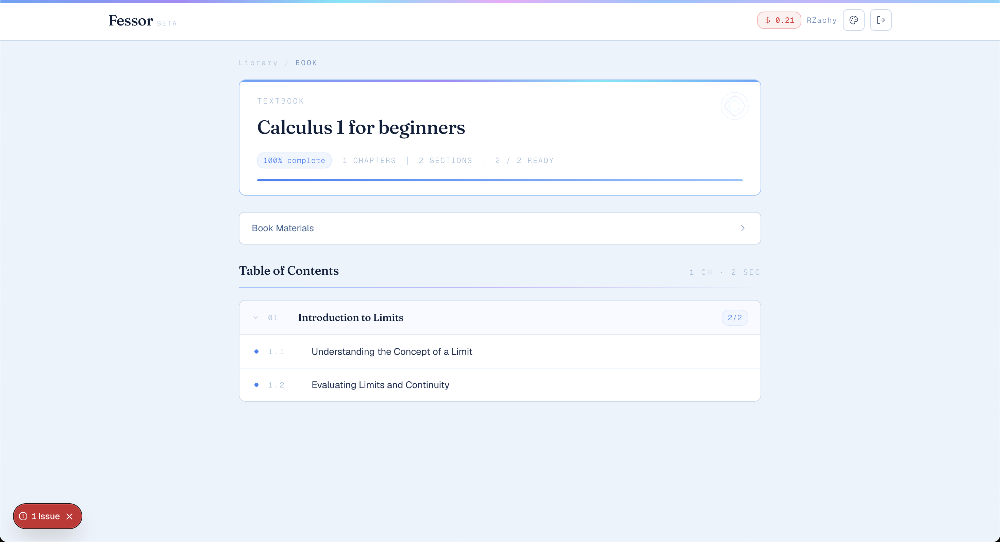
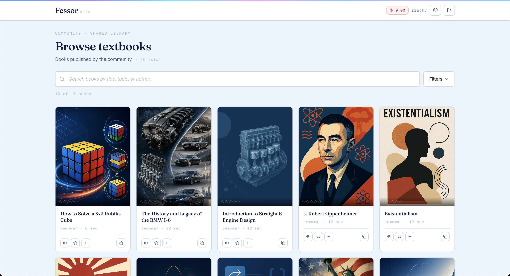
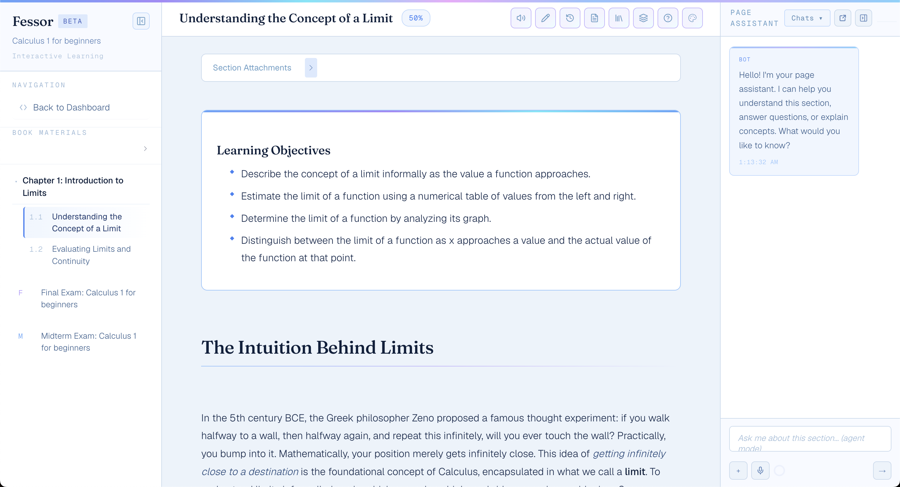
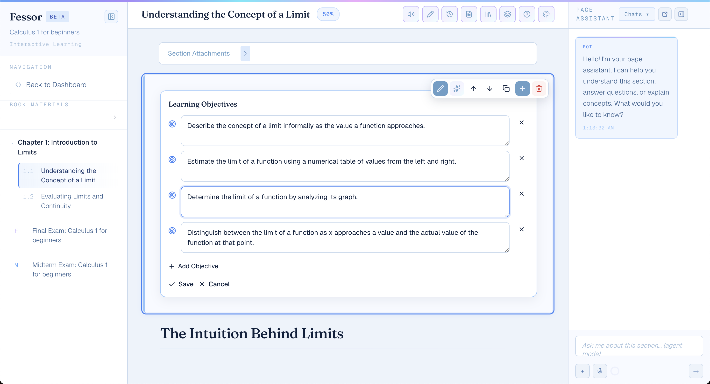
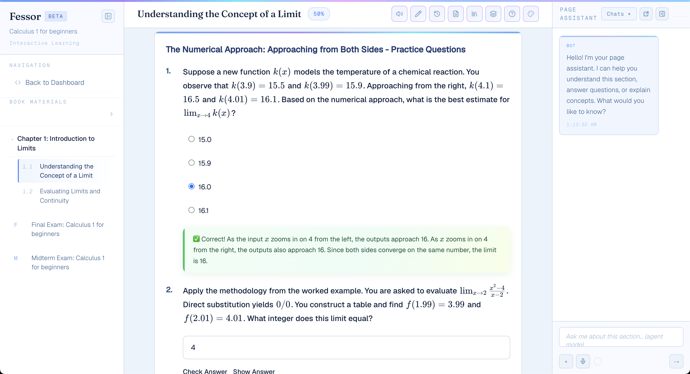
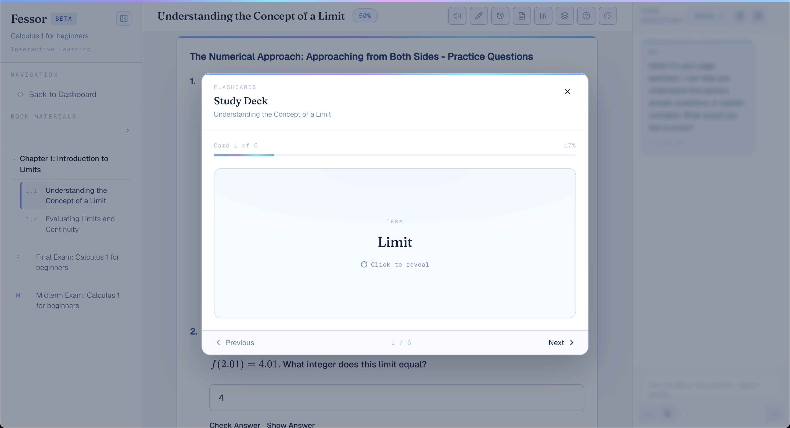
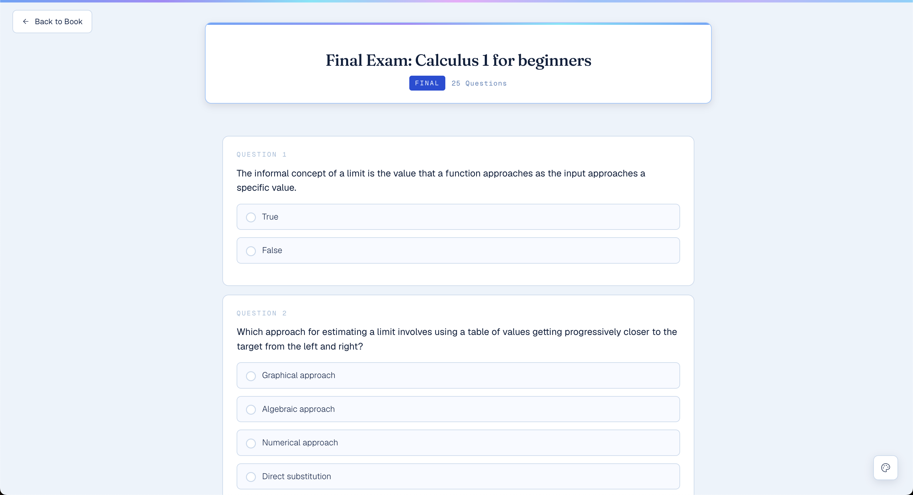

# Fessor.ai

AI-powered textbook generation platform that transforms a topic into structured educational content with chapters, quizzes, flashcards, exams, images, and interactive learning experiences.

**Live product:** https://fessor.ai

---

## Overview

Fessor orchestrates multiple AI models to generate complete textbooks and learning materials from a single prompt.

The platform combines:

- Structured chapter generation
- Interactive quizzes
- Flashcards
- Exams
- Page-level AI assistant
- Image generation
- Public textbook library
- Credit-based usage
- Multi-provider AI orchestration

---

## Demo Screenshots

### Landing Page

---

### Generation Flow

---

### Public Library

---

### Textbook Reader + AI Assistant

---

### Editing Mode

---

### Interactive Quizzes

---

### Flashcards

---

### Exams

---

# Major Features

### AI Textbook Generation

Generate complete books from a topic prompt.

Includes:

- Chapters
- Sections
- Learning objectives
- Explanations
- Images
- Examples

---

### Interactive Learning

Students can reinforce understanding through:

- Multiple choice quizzes
- Open-ended questions
- Flashcards
- Exams

---

### Page Assistant

Context-aware AI assistant capable of:

- Answering questions
- Explaining concepts
- Referencing page content
- Editing content
- Working with uploaded files

---

### Public Library

Users can:

- Browse community-created textbooks
- Search books
- Bookmark content
- Reuse materials

---

### Content Editing

Supports:

- Rich text editing
- Attachments
- Learning objectives
- Section metadata
- Iterative refinement

---

## High-Level Architecture

Frontend:

- Next.js
- React

Backend:

- Django
- Django Channels
- Celery

Infrastructure:

- PostgreSQL
- Redis
- Docker
- Google Cloud Platform

---

## Tech Stack

### Frontend

- Next.js 15
- React 19
- TypeScript

### Backend

- Django 4.2
- Django Channels
- Daphne
- Celery

### Databases

- PostgreSQL
- Redis

### Infrastructure

- Docker
- Google Cloud Platform
- Cloud SQL
- Memorystore
- Cloud Storage

### AI Providers

- OpenAI
- Claude
- Gemini

---

## Documentation

Architecture:

- docs/ARCHITECTURE.md

System Design:

- docs/SYSTEM_DESIGN.md

AI Pipeline:

- docs/AI_PIPELINE.md

Contributions:

- docs/CONTRIBUTIONS.md

Future Improvements:

- docs/FUTURE_IMPROVEMENTS.md

---

## Design Goals

Fessor is designed around three principles:

1. Structured educational content
2. Interactive learning experiences
3. Scalable AI orchestration

---

## Disclaimer

This repository is intended as an architecture and technical showcase for the deployed product at Fessor.ai and does not contain the production source code.