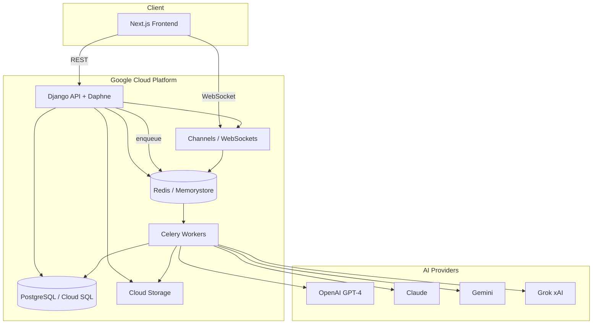

# Fessor Architecture

## Overview

Fessor is an AI-powered educational platform that generates textbooks and interactive learning experiences.

The architecture separates:

- Frontend
- Backend APIs
- Async workers
- Databases
- AI providers
- Storage systems

For request-level flows and ownership rules, see [System Design](SYSTEM_DESIGN.md). For model routing and pipeline stages, see [AI Pipeline](AI_PIPELINE.md).

---

## Component Diagram

---

## Frontend

Built with:

- Next.js 15
- React 19
- TypeScript

Responsibilities:

- Reader UI
- Editor
- Dashboard
- Library
- Quizzes
- Flashcards
- Exams
- Page Assistant

The frontend talks to Django over REST for durable operations and over WebSockets for streaming assistant output and generation progress.

---

## Backend

Built with:

- Django 4.2
- Django Channels
- Daphne

Responsibilities:

- Authentication
- Credits
- Generation APIs
- Content management
- WebSockets
- User accounts

The API layer stays thin: validate, authorize, persist, enqueue. It does not perform long-running model inference directly.

---

## Async Processing

Celery workers execute long-running jobs:

- Book generation
- Image generation
- Analytics
- Background processing

Celery Beat handles scheduled jobs.

Workers pull tasks from Redis, call external AI providers, and write results to PostgreSQL and Cloud Storage. See [Async Workflows](ASYNC_WORKFLOWS.md) for queue design, retries, and scaling.

---

## Databases

### PostgreSQL

Stores:

- Users
- Books
- Sections
- Chapters
- Exams
- Quiz attempts
- Credits

PostgreSQL is the source of truth for ownership, content structure, and billing-related state.

### Redis

Used for:

- Cache
- Celery broker
- Channel layer
- Realtime messaging

Redis decouples web processes from workers and powers cross-process WebSocket fan-out.

---

## AI Layer

Multiple providers are orchestrated depending on the task:

- OpenAI (GPT-4)
- Claude
- Gemini
- Grok (xAI)

Different models are used for:

- Planning
- Writing
- Attachments
- OCR
- Assistant interactions

Routing is task-based rather than single-model. The orchestration layer selects a provider based on generation settings and the type of work being performed. See the model routing table in [AI Pipeline](AI_PIPELINE.md).

---

## File Attachments

Supports:

- PDFs
- Images

Attachments are stored in Cloud Storage, processed in worker tasks, and incorporated into generation and assistant workflows. PDF text extraction and image OCR feed context into planning and section prompts.

---

## Deployment

Development:

- Docker Compose

Production:

- Google Cloud Platform

Components:

- Compute Engine
- Cloud SQL
- Memorystore
- Cloud Storage

Web and worker processes can be deployed and scaled independently on Compute Engine. Managed Cloud SQL and Memorystore reduce operational overhead for the database and Redis layers.

---

## Realtime Features

Django Channels powers:

- Streaming responses
- Assistant interactions
- Progress updates

Channels uses Redis as the channel layer so multiple Daphne processes can broadcast to connected clients. See [Realtime Architecture](REALTIME_ARCHITECTURE.md).

---

## Scaling Considerations

### Horizontal worker scaling

Book and image generation are CPU- and IO-light on the worker itself; throughput is bounded mainly by provider latency and rate limits. Adding Celery workers increases parallel section and image jobs. Workers scale independently from Django web processes so generation load does not crowd out sync API traffic.

### Redis-backed messaging

Redis serves as the Celery broker and Channels layer. A managed Memorystore instance avoids single-host broker failures and supports higher connection counts as web and worker fleets grow.

### External AI providers

Provider APIs are the elastic boundary. Multi-provider support (OpenAI, Claude, Gemini, Grok) allows routing work away from a degraded provider. Async execution prevents provider slowness from blocking HTTP responses.

### Async task queues

Generation is split into discrete tasks (planning, sections, images, assessments). Smaller units improve retry granularity and let the UI show incremental progress. Separate queues can isolate slow image work from text generation if needed.

### Managed databases

Cloud SQL provides automated backups, replication options, and vertical scaling for PostgreSQL. Incremental per-section writes keep transaction size manageable as book volume grows.

### API tier

Stateless Django instances behind a load balancer handle reader, library, and editor traffic. Because AI inference runs in workers, API instances scale on HTTP concurrency and database read load rather than model latency.

---

## Related Documents

- [System Design](SYSTEM_DESIGN.md)
- [AI Pipeline](AI_PIPELINE.md)
- [Async Workflows](ASYNC_WORKFLOWS.md)
- [Realtime Architecture](REALTIME_ARCHITECTURE.md)
