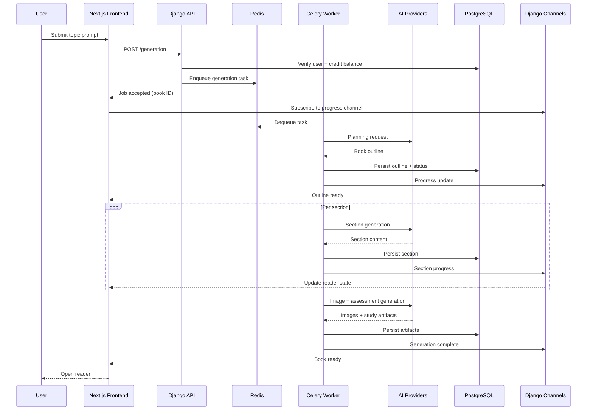

# System Design

This document describes how Fessor.ai handles user requests, long-running generation, data ownership, credits, failures, and scaling. For component-level detail see [Architecture](ARCHITECTURE.md). For model-level behavior see [AI Pipeline](AI_PIPELINE.md).

---

## Sync Request Path

Most interactive product actions follow a standard request-response cycle through the Django API and PostgreSQL.

**Typical sync operations**

- Authentication and session management
- Loading books, sections, library listings, and study artifacts
- Saving editor changes to a section
- Submitting quiz answers and recording attempts
- Credit balance reads
- Initiating generation (enqueue only — not the generation itself)

**Flow**

```text
Browser → Next.js client → Django REST API → PostgreSQL / Redis
                                      ↓
                               Response to client
```

Sync paths are kept short. The API validates the user, checks permissions and credits where needed, reads or writes durable state, and returns. Heavy AI work is never done inline on the request thread.

---

## Async Generation Path

Book creation and other long-running AI work are handled outside the HTTP request lifecycle.

**Typical async operations**

- Book planning
- Chapter and section generation
- Image generation
- Quiz, flashcard, and exam creation
- Attachment processing (PDF extraction, OCR)

**Flow**

```text
Browser → API: create generation job
              ↓
         Credit check + enqueue (Celery)
              ↓
         Redis broker → Celery worker(s)
              ↓
         AI providers (OpenAI, Claude, Gemini, Grok)
              ↓
         PostgreSQL + Cloud Storage
              ↓
         WebSocket progress → Browser
```

The client receives an immediate acknowledgment that the job started. Workers publish incremental progress and final state through the realtime layer. See [Async Workflows](ASYNC_WORKFLOWS.md) and [Realtime Architecture](REALTIME_ARCHITECTURE.md).

---

## End-to-End Sequence

The diagram below shows a typical book generation flow from prompt to reader.



---

## Main Components

```text
Frontend (Next.js)
        ↓
API Layer (Django)
        ↓
Celery Workers ←→ Redis (broker, cache, channel layer)
        ↓
PostgreSQL + Cloud Storage
        ↓
AI Providers (OpenAI, Claude, Gemini, Grok)
```

| Layer | Role |
|-------|------|
| Frontend | Reader, editor, library, study modes, assistant UI |
| API | Auth, credits, CRUD, job enqueue, ownership checks |
| Celery | Long-running AI and media tasks |
| Redis | Task broker, cache, Channels layer |
| PostgreSQL | Users, books, content, credits, attempts |
| Cloud Storage | Attachments, generated images, large blobs |
| AI providers | Planning, writing, OCR, images, assistant |

---

## Data Ownership Model

All user-generated content is scoped to an owning account.

**Ownership rules**

- Books, sections, edits, and study artifacts belong to the user who created them (or the account that owns the parent book)
- Library visibility is controlled by publish state: private books are readable only by the owner; public books are discoverable in the shared library
- Attachments are tied to the user and the book or section that referenced them
- Quiz attempts and exam submissions belong to the user who submitted them

**Access enforcement**

- API handlers validate ownership before reads and writes
- Assistant and edit endpoints scope context to the active section the user is permitted to view
- Public library endpoints expose only content explicitly published by its owner

This model keeps generation output, edits, and learning history isolated per account unless the owner chooses to publish.

---

## Credit Metering Flow

Fessor uses credits to gate AI-heavy operations.

```text
User action request
        ↓
API loads current credit balance (PostgreSQL)
        ↓
Sufficient balance? ──no──→ Reject with clear error
        │
       yes
        ↓
Reserve or debit credits for the operation
        ↓
Enqueue async work or call provider (assistant)
        ↓
On failure before work starts → no charge or reversal
On success → usage recorded against the job or session
```

**Where metering applies**

- Starting a book generation job
- Assistant conversations and edit actions
- Regeneration of sections or media
- Attachment processing that invokes provider-backed OCR or summarization

Metering is checked before enqueue so users do not accumulate silent debt on jobs that cannot complete. Async stages that retry do not double-charge for the same logical unit of work when retries are part of recovering a single failed section.

---

## Failure and Retry Behavior

| Scenario | Handling |
|----------|----------|
| HTTP validation error | Immediate 4xx response; no task enqueued |
| Insufficient credits | Rejected at API; no worker pickup |
| Provider timeout in worker | Celery retry with backoff; section-level retry where possible |
| Malformed model output | Validation step rejects; stage retries or marks unit failed |
| Worker process crash | Task redelivered from Redis; idempotent writes limit duplication |
| WebSocket disconnect | Client reconnects and resubscribes; durable state loaded from PostgreSQL |
| Partial book failure | Completed sections remain available; failed units reported in progress state |

The platform separates **request failure** (user cannot start work) from **stage failure** (one section or image fails while the rest of the book continues). See [AI Pipeline](AI_PIPELINE.md) for validation and fallback detail.

---

## Realtime Layer

WebSockets through Django Channels support:

- Streaming assistant responses
- Generation progress updates
- Incremental UI refresh as sections complete

Sync APIs remain the source of truth for durable state. Realtime messages notify the client that new data is available; the client loads or patches state accordingly. See [Realtime Architecture](REALTIME_ARCHITECTURE.md).

---

## Scaling Considerations

**API tier**

- Stateless Django processes behind a load balancer
- Horizontal scaling for read-heavy library and reader traffic
- Short request handlers; no long AI calls on web workers

**Worker tier**

- Celery workers scaled independently from web processes
- Book generation throughput increases with worker count until provider rate limits or database write throughput become the bottleneck
- Image and text tasks can be separated into queues so slow image work does not starve section generation

**Redis**

- Broker for Celery and backend for Channels
- Memorystore in production for managed failover and capacity

**PostgreSQL**

- Cloud SQL for managed backups and scaling
- Incremental writes per section avoid single large transactions for entire books

**AI providers**

- External APIs are the primary latency and rate-limit boundary
- Multi-provider routing (OpenAI, Claude, Gemini, Grok) provides flexibility when one provider is degraded
- Async design absorbs provider variability without blocking user-facing requests

**Storage**

- Cloud Storage offloads images and attachments from the database
- CDN or signed URL patterns can reduce load on the API for media delivery

---

## Related Documents

- [Architecture](ARCHITECTURE.md)
- [AI Pipeline](AI_PIPELINE.md)
- [Async Workflows](ASYNC_WORKFLOWS.md)
- [Realtime Architecture](REALTIME_ARCHITECTURE.md)
